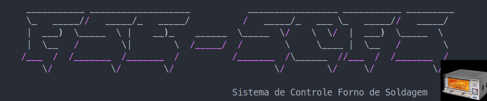
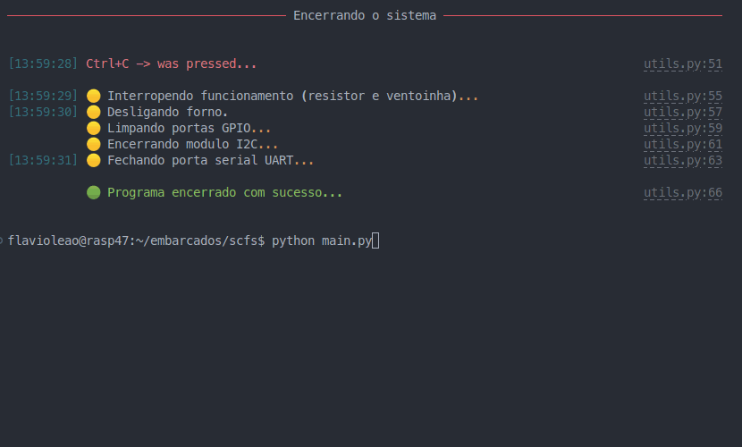
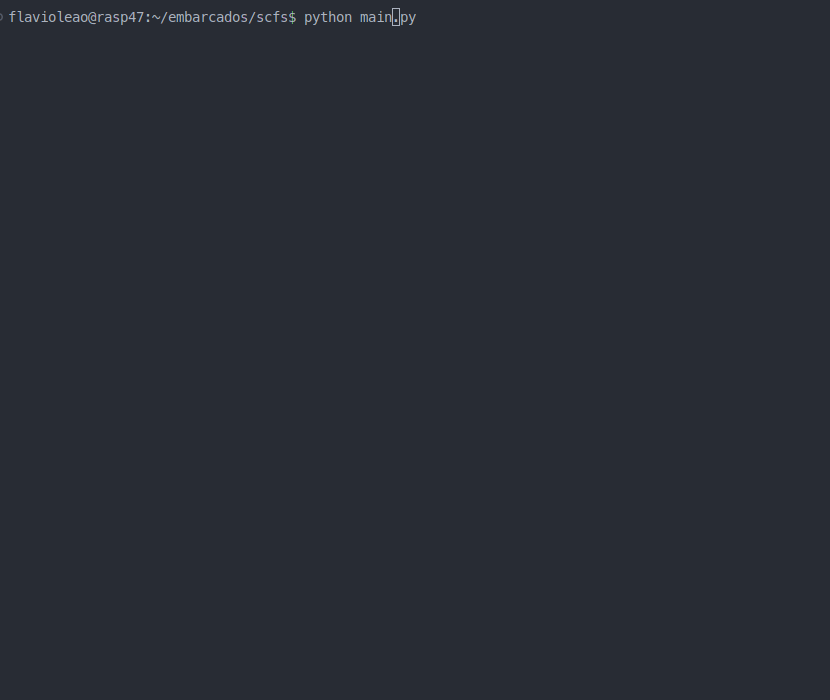
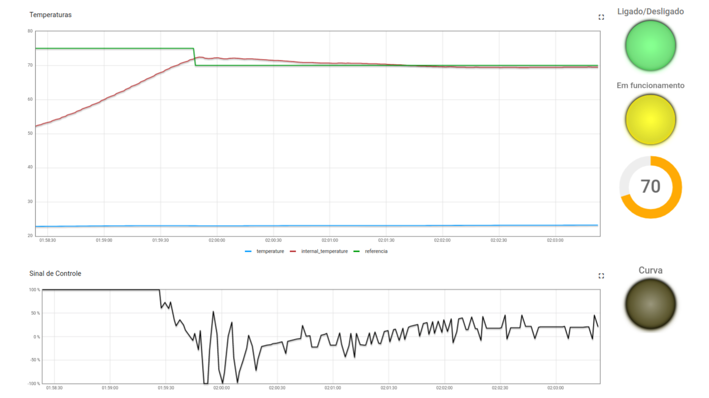
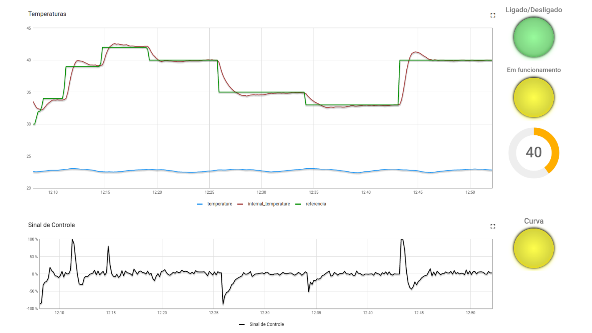

## Trabalho 2 - Sistema de Controle Forno de Soldagem - SCFS

---
<p align="center"> </p>

---

### 1. Visão Geral

  SCFS é um Sistema  que efetua o controle de temperatura do forno utilizando dois atuadores para este controle: um **resistor de potência** de 15 Watts utilizado para aumentar temperatura e; uma **ventoinha** que puxa o ar externo (temperatura ambiente) para reduzir a temperatura do sistema e tem  por objetivo simular o controle de um forno para soldagem de placas de circuito impresso (PCBs).
<br />

### 2. Principais Funcionalidades

1. Implementar o controle de temperatura do ambiente fechado utilizando o controle PID atuando sobre o Resistor e a Ventoinha;
1. Definir temperatura manualmente através do seletor de temperatura no dashboard (Thingsboad);
2. Definir temperatura automaticamente seguindo uma curva de temperatura pré-definida em arquivo de configuração ([Arquivo da Curva](./curva_reflow.csv)).
3. Gerar um log em arquivo CSV com (Data e hora, temperatura interna, temperatura externa, temperatura de referencia, sinal de controle (Resistor e Venoinha)).

<br />

### 3. Arquitetura do Sistema

<p align="center"> </p>
<br />

#### 3.1 Componentes do Sistema

* Ambiente fechado controlado com o resistor de potência e ventoinha;
* 01 Sensor DS18B20 (1-Wire) para a medição da temperatura interna (**TI**) do sistema;
* 01 Sensor BME280 (I2C) para a medição da temperatura externa (**TE**);
* 01 Conversor lógico bidirecional (3.3V / 5V);
* 01 Driver de potência para acionamento de duas cargas (L297);
* 01 ESP32;
* 01 Raspberry Pi 4;
<br />

### 4. Requisitos

* RPi.GPIO
* RPi.bme280
* rich
* smbus2

<br />  

### 5. Guia de instalação  

*Clone esse repositório em uma raspberry PI.  

```
git clone https://github.com/flaviovl/embarcados/
cd embarcados/scfs
```

* Crie e ative um virtualenv com Python 3.  

```
python3 -m venv .venv
source .venv/bin/activate
```

* Instale as dependências.  

```
pip install -r requirements.txt
```

<br />  

### 6. Como utilizar

Após instalar todos os requisitos executar o main.py.

```
python main.py
```

Assim que iniciar o programa estrá no menu principal com as seguintes opçoes.
<br />

##### 6.1 Modo de controle terminal (opção t)

<p align="center"> </p>
<br />  

##### 6.2 Modo de controle curva (opção c)

<p align="center"> </p>
<br />  

##### 6.3 Modo de controle dashboard (opção d)

<p align="center"> </p>
<br />  

### 6. Gráficos dos experimentos

#### 6.1 Experimento de temperatura fixa

Temperatura definida manualmente através do seletor de temperatura no dashboard (Thingsboad)
<p align="center"> </p>
<br />  

#### 6.1 Experimento de temperatura variável

Temperatura automaticamente seguindo uma curva de temperatura pré-definida em arquivo de configuração ([Arquivo da Curva](./curva_reflow.csv)).
<p align="center"> </p>
<br />  

obs: Outras imagens do experimento na pasta imgs.

## 7. License

AGPL-3.0 License
